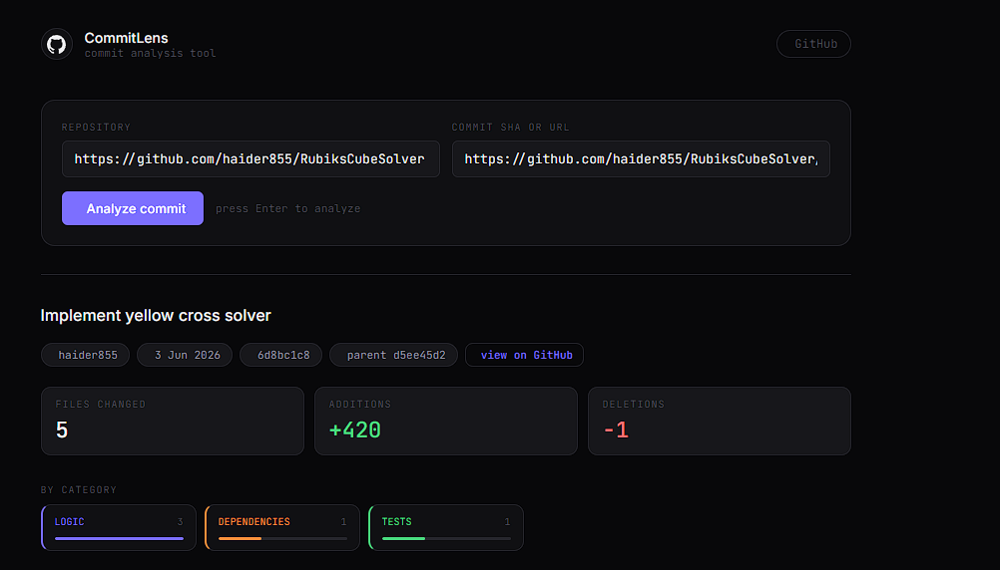
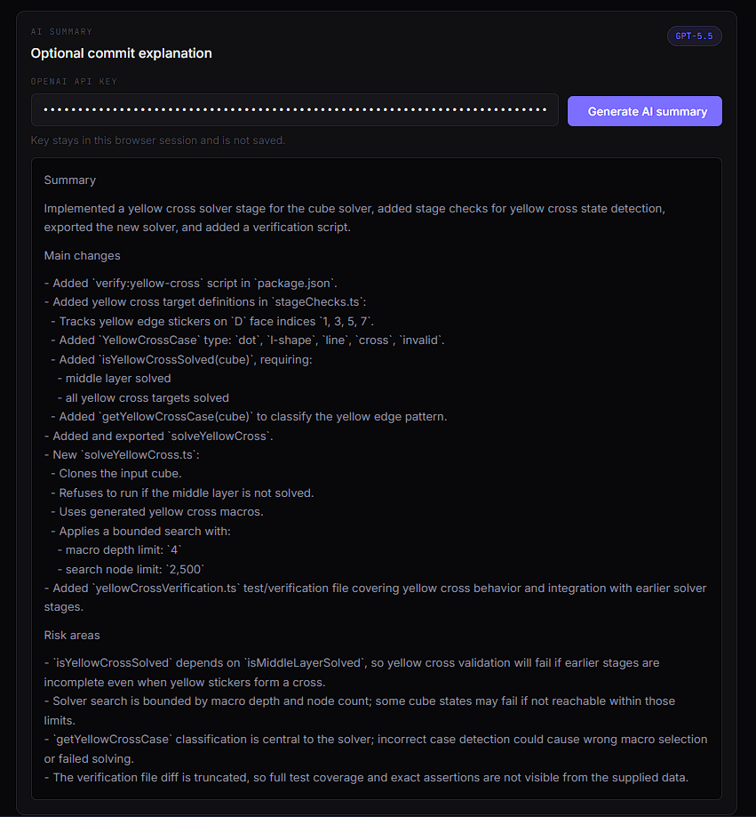
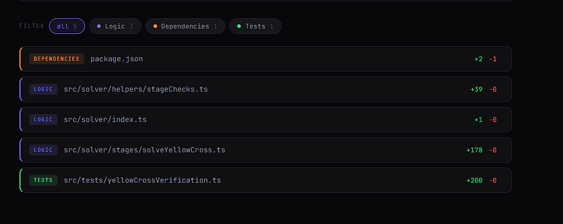

# CommitLens

CommitLens is a developer tool for understanding what changed in a specific GitHub commit. Enter a public GitHub repository and commit SHA or commit URL, and the app compares the commit against its parent, classifies changed files, shows diff previews, and can optionally generate an AI summary using your own OpenAI API key.

## Live Demo

CommitLens is available on GitHub Pages:

[Open CommitLens](https://haider855.github.io/GitHubCommitComparer/)



## Features

- Analyze a public GitHub commit by repository and SHA
- Supports `owner/repo`, GitHub URLs, and full commit URLs
- Fetches commit metadata from GitHub
- Compares the selected commit against its direct parent
- Shows commit message, author, date, SHA, parent SHA, and GitHub link
- Displays total files changed, additions, and deletions
- Classifies changed files into clear categories
- Filters changed files by category
- Shows expandable diff previews
- Supports optional AI-generated commit summaries

## Screenshots

### Commit Analysis


### AI Summary



### Diff Preview



## File Categories

Changed files are classified using deterministic rules into:

- UI
- Logic
- Config
- Dependencies
- Documentation
- Tests
- Assets
- Build/Tooling
- Other

## Optional AI Summary

The AI summary feature is optional.

If you want to use it, enter your own OpenAI API key in the AI Summary panel after analyzing a commit. The key is kept only in the current browser session and is not saved to local storage, committed, or stored by this app.

The app sends commit metadata, file categories, stats, and limited diff context directly from your browser to OpenAI.

Notes:

- You need a valid OpenAI API key.
- Your OpenAI account must have access to the configured model.
- OpenAI usage may cost money depending on token usage.

## Tech Stack

- React
- TypeScript
- Vite
- Plain CSS
- GitHub REST API
- OpenAI Responses API for optional AI summaries

## How It Works

1. Enter a public GitHub repository.
2. Enter a commit SHA or full commit URL.
3. The app fetches the commit from GitHub.
4. The app finds the direct parent commit.
5. The app compares the parent commit to the selected commit.
6. Changed files are classified by deterministic rules.
7. The UI displays metadata, category summaries, file cards, and diff previews.
8. Optionally, enter an OpenAI API key to generate an AI summary.

## Example Input

Repository:

```text
facebook/react
```

Commit SHA:

```text
bf76955e0f2886b7f0bd6eb24154be1ad90393e5
```

You can also use full GitHub repository URLs and commit URLs.

## Limitations

- Only public GitHub repositories are supported.
- Private repositories are not supported.
- Merge commits are not supported.
- Root commits are not supported because they do not have a parent commit.
- GitHub API rate limits may apply.
- Large diffs are truncated in the UI and AI prompt.
- AI summaries require the user to provide their own OpenAI API key.

## Future Improvements

- Pull request analysis
- Multi-commit comparison
- Merge commit support
- Private repository support with GitHub OAuth
- Better diff search and navigation
- Export summary as Markdown
- Shareable analysis links
